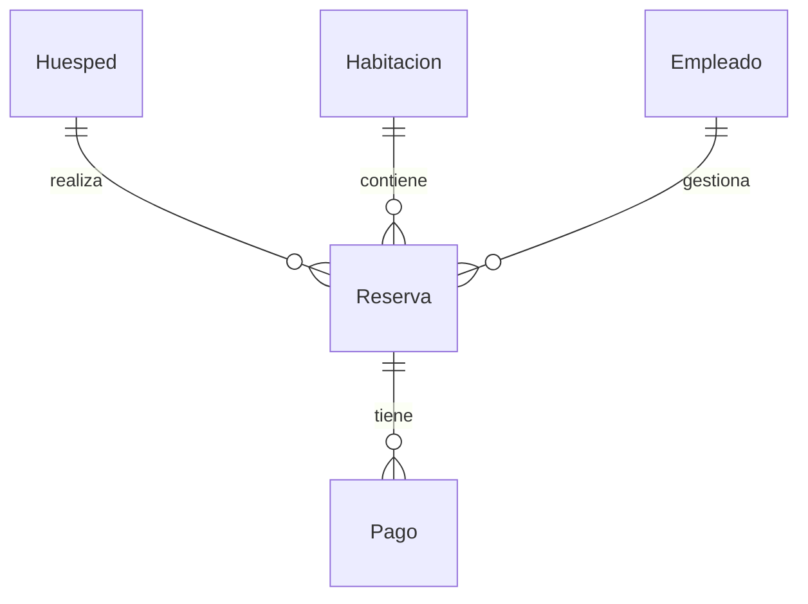

# Sistema de Gestión de Reservas Hotel

Aplicación web ASP.NET Core MVC con Entity Framework Core y SQL Server para administrar reservas de un hotel. El sistema implementa **5 entidades** con **5 atributos** cada una, relacionadas entre sí, y expone operaciones CRUD generadas mediante scaffolding.

## Tecnologías

- ASP.NET Core MVC (.NET 10)
- Entity Framework Core 10
- SQL Server
- Bootstrap 5

## Entidades y atributos

| Entidad      | Atributos                                              |
|--------------|--------------------------------------------------------|
| Huésped      | id, nombre, apellido, email, teléfono                  |
| Habitación   | id, número, tipo, precio_noche, capacidad              |
| Reserva      | id, fecha_inicio, fecha_fin, estado, total             |
| Pago         | id, monto, método, fecha_pago, estado                  |
| Empleado     | id, nombre, cargo, email, turno                        |

## Relaciones



- Un **Huésped** puede tener muchas **Reservas**.
- Una **Habitación** puede tener muchas **Reservas**.
- Un **Empleado** gestiona muchas **Reservas**.
- Una **Reserva** puede tener muchos **Pagos**.

Las claves foráneas se definen en `Reserva` (`huesped_id`, `habitacion_id`, `empleado_id`) y en `Pago` (`reserva_id`).

## Estructura del proyecto

```
Controllers/     Controladores CRUD (Huesped, Habitacion, Reserva, Pago, Empleado)
Models/          Modelos de las 5 entidades con validaciones
Data/            ApplicationDbContext y migraciones EF Core
Views/           Vistas Razor (Index, Create, Edit, Details, Delete)
```

## Requisitos

- [.NET 10 SDK](https://dotnet.microsoft.com/download)
- SQL Server (instalación local o contenedor Docker)
- Herramientas de EF Core (incluidas en el proyecto)

## Configuración

### 1. Base de datos

Edita la cadena de conexión en `appsettings.json`:

```json
"DefaultConnection": "Server=localhost,1433;Database=GestionReservasHotel;User Id=sa;Password=TuPasswordSeguro123!;TrustServerCertificate=True;MultipleActiveResultSets=true"
```

Para levantar SQL Server con Docker:

```bash
docker run -e "ACCEPT_EULA=Y" -e "SA_PASSWORD=TuPasswordSeguro123!" \
  -p 1433:1433 --name sqlserver-hotel -d mcr.microsoft.com/mssql/server:2022-latest
```

### 2. Migraciones

Desde la raíz del proyecto:

```bash
dotnet ef database update
```

Si necesitas crear una nueva migración tras cambios en los modelos:

```bash
dotnet ef migrations add NombreMigracion --output-dir Data/Migrations
```

### 3. Ejecutar la aplicación

```bash
dotnet run
```

La aplicación estará disponible en:

- HTTP: `http://localhost:5204`
- HTTPS: `https://localhost:7045`

## Funcionalidades

| Módulo       | Descripción                                              |
|--------------|----------------------------------------------------------|
| Huéspedes    | Registro y consulta de datos de contacto                 |
| Habitaciones | Administración de tipos, precios y capacidad               |
| Reservas     | Creación de reservas vinculando huésped, habitación y empleado |
| Pagos        | Registro de pagos asociados a una reserva                |
| Empleados    | Gestión del personal y sus turnos                        |

Cada módulo incluye listado, creación, edición, detalle y eliminación.

## Orden sugerido de uso

1. Registrar **Empleados** y **Habitaciones**.
2. Registrar **Huéspedes**.
3. Crear **Reservas** seleccionando huésped, habitación y empleado.
4. Registrar **Pagos** asociados a las reservas creadas.
